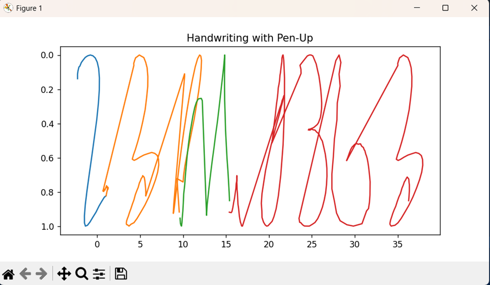

# 📝 Handwriting Generation using LSTM

## 📌 Overview
This project generates handwriting trajectories using **Long Short-Term Memory (LSTM)** networks. Instead of images, handwriting is modeled as a **sequence of (x, y) coordinates**, allowing the model to learn pen motion over time.

The system can:
- Predict next stroke points  
- Generate smooth handwriting trajectories  
- Form words by combining characters  
- Visualize and animate writing  

---

## 🎯 Objectives
- Model handwriting as a **time-series problem**
- Train LSTM networks for sequence prediction
- Generate realistic trajectories
- Construct words from characters
- Visualize results

---

## 📂 Project Structure
```
Handwriting-Generator/
│
├── models/ # Saved per-character models (.pt)
├── report_images/ # Generated plots for report
├── uji+pen+characters/ # Dataset
│
├── train.py # Training script
├── infer.py # Word generation + animation
├── inference.py # Report plot generation
│
└── README.md
```

---

## 📊 Dataset
Uses the **UJI Pen Characters dataset**.

### Features
- Characters: A–Z  
- Sequential (x, y) coordinates  
- Multi-stroke data  
- Pen-up / pen-down information  

---

## ⚙️ Methodology

### Data Normalization
$x' = \frac{x - \mu}{\sigma}, \quad y' = \frac{y - \mu}{\sigma}$

### Sequence Modeling
Input:
$(x_1, y_1), \dots, (x_L, y_L)$

Target:
$(x_2, y_2), \dots, (x_{L+1}, y_{L+1})$

---

## 🧠 Model Architecture

| Component | Value |
|----------|------|
| Input Size | 2 |
| Hidden Size | 128 |
| Layers | 2 |
| Dropout | 0.2 |
| Output | 2 |

Forward pass:
$\hat{Y} = \text{Linear}(\text{LSTM}(X))$

---

## 📉 Loss Function
Mean Squared Error (MSE):
$\mathcal{L} = \frac{1}{N} \sum (y - \hat{y})^2$

---

## 🔄 Training Strategy
- Separate model per character  
- Improves consistency  
- Models saved in `models/`

---

## 🚀 Usage

### Train Models
```
python train.py
```

### Generate Handwriting
```
python writing.py
```

Example input:
```
HELLO WORLD
```

---

### Generate Report Plots

python inference.py


Saved in:
```
report_images/
```

---

## 📊 Outputs
- Generated handwriting trajectories  
- Word-level writing  
- Error plots (MSE)  
- Weight distribution  
- Trajectory vector fields  

---

## 📸 Example Outputs

The image spells 23RAI313 but it looks shabby as there is not pen-up function

---

## ⚠️ Limitations
- Learns local motion, not full shape  
- Pen-up not fully learned  
- Drift in long sequences  
- Limited dataset  

---

## 🔮 Future Work
- Predict pen-state (x, y, pen)  
- Use advanced generative models  
- Improve stroke realism  
- Integrate with robotics  

---

## 🧠 Key Insight
> LSTM captures temporal motion but does not enforce global structure.

---

## 🛠️ Technologies
- Python  
- PyTorch  
- NumPy  
- Matplotlib  

---

## 👨‍💻 Author
A C Anirudh

---

## 📌 Notes
- Avoid naming files like `typing.py`
- Ensure dataset path is correct